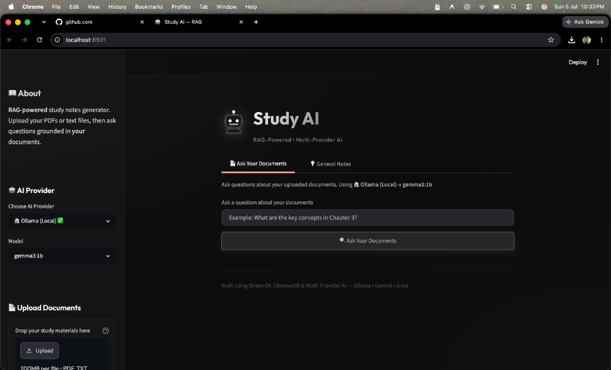
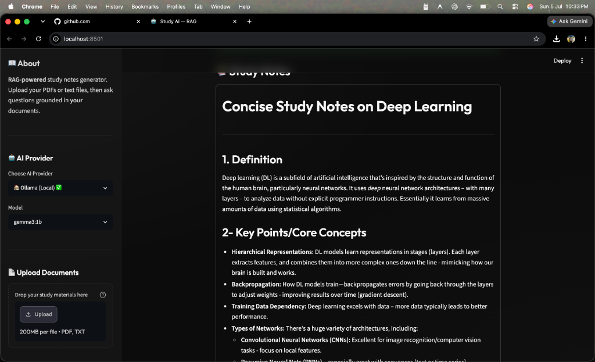

# 🤖 Study AI — RAG-Powered Study Notes Generator

<p align="center">
  
</p>

<p align="center">
  
  
  
  
  
  
  <a href="https://linkedin.com/in/vedantdubey20"></a>
</p>

<p align="center">
  <a href="https://studyai-6q5gxcbbl4l63jh8clpnf5.streamlit.app/" target="_blank">
    
  </a>
</p>

---

## 📖 Introduction

**Study AI** is a premium, RAG-powered (Retrieval-Augmented Generation) study notes generator. It allows you to upload your own study materials (PDFs, textbooks, or TXT files) and obtain precise, comprehensive notes and answers **grounded directly in your documents**. 

With support for both **100% local execution** (using Ollama) and **cloud-based providers** (Google Gemini & Groq APIs), Study AI gives you the flexibility of local privacy or high-speed cloud generation—all wrapped in an ultra-premium, responsive **glassmorphic matte-black** design.

⭐ **If you find this project helpful, please consider leaving a star to support its development!**

---

## ✨ Key Features

*   **📄 Intelligent RAG Pipeline**: Upload PDFs or TXT files. The app chunks, embeds, and stores them in a local vector database, letting you ask questions that are answered strictly using your uploaded materials.
*   **🤖 Multi-Provider LLM Support**:
    *   **Ollama (Local)**: Run completely offline and privately using `gemma3:1b` (or any local model).
    *   **Google Gemini (API)**: Use the powerful `gemini-2.0-flash` or `gemini-1.5-flash` for high-quality, smart responses.
    *   **Groq (API)**: Experience blazing-fast speeds with models like `llama-3.3-70b`, `gemma2-9b`, and `mixtral-8x7b`.
*   **🎨 Premium Glassmorphism UI**: Beautiful dark-mode dashboard with frosted-glass panels, custom SVG robot logo branding, responsive layouts, and modern typography.
*   **📑 Smart Source Citations**: Every answer generated in RAG mode lists the exact document chunks retrieved, along with similarity/relevance percentages.
*   **💡 General Notes Mode**: Quickly generate structured study guides (Definitions, Key Points, Examples, Summaries) on any topic from the LLM's general knowledge.
*   **📥 One-Click Export**: Instantly download your generated study notes as clean text files.

---

## 📸 Visual Walkthrough

### 🚀 Interactive Dashboard & Sidebar
Configure your preferred AI Provider (Local or Cloud), upload your study materials, and manage your vector database collection directly from the sidebar.
<p align="center">
  
</p>

### 📚 Grounded Answers & Study Notes
Generate well-structured, concise, and academic-grade study guides and answers based strictly on your document context.
<p align="center">
  
</p>

---

## 🧩 Technical Architecture

```
┌────────────────┐     ┌──────────────┐     ┌──────────────┐     ┌──────────────┐
│  Upload PDF/   │ ──▶ │  Extract     │ ──▶ │  Chunk Text  │ ──▶ │  Embed via   │
│  TXT Files     │     │  Text        │     │  (500 chars) │     │  nomic-embed │
└────────────────┘     └──────────────┘     └──────────────┘     └──────┬───────┘
                                                                        │
                                                                        ▼
┌────────────────┐     ┌──────────────┐     ┌──────────────┐     ┌──────────────┐
│  Grounded      │ ◀── │ Generate via │ ◀── │ Inject Top 5 │ ◀── │  Store in    │
│  Answer +      │     │ Gemini/Groq/ │     │ Chunks into  │     │  ChromaDB    │
│  Citations     │     │ Ollama       │     │ LLM Prompt   │     │  (Vector DB) │
└────────────────┘     └──────────────┘     └──────────────┘     └──────────────┘
                             ▲
                             │
                      ┌──────┴──────┐
                      │  User asks  │
                      │  a question │
                      └─────────────┘
```

### Component Stack

| Component | Tool | Purpose |
|-----------|------|---------|
| **LLM Backends** | Ollama, Google Gemini API, Groq API | Answer generation |
| **Embeddings** | Ollama (`nomic-embed-text`) | Local vector embeddings for similarity matching |
| **Vector DB** | ChromaDB (Persistent client) | Storing and retrieving document chunks locally |
| **PDF Parser** | PyPDF2 | PDF text extraction |
| **Text Splitter** | LangChain Text Splitters | Recursive character splitting (500-char chunks) |
| **UI Frontend** | Streamlit | Glassmorphic web dashboard |

---

## 🛠️ Installation & Setup

### 1. Prerequisites
Make sure you have **Python 3.10+** and **Ollama** installed on your system.

*   Download Ollama: [ollama.com/download](https://ollama.com/download)
*   Pull the local models used for embeddings and local generation:
    ```bash
    ollama pull nomic-embed-text
    ollama pull gemma3:1b
    ```

### 2. Clone and Setup
```bash
# Clone the repository
git clone https://github.com/vedantdubey19/Study_Ai.git
cd Study_Ai

# Create and activate a virtual environment
python3 -m venv venv
source venv/bin/activate

# Install the required dependencies
pip install -r requirements.txt
```

### 3. Add API Keys (Optional)
If you want to use Google Gemini or Groq, create a `.env` file in the root directory:
```env
GEMINI_API_KEY="your_gemini_api_key_here"
GROQ_API_KEY="your_groq_api_key_here"
```
*(Note: `.env` is already added to `.gitignore` to keep your credentials safe from being pushed to GitHub).*

### 4. Run the Application
```bash
streamlit run streamlit_app.py --browser.gatherUsageStats false
```
The application will launch automatically in your browser at **`http://localhost:8501`**.

---

## 🤝 Contributing

Contributions make the open-source community an amazing place to learn, inspire, and create. Any contributions you make are **greatly appreciated**.

1. Fork the Project
2. Create your Feature Branch (`git checkout -b feature/AmazingFeature`)
3. Commit your Changes (`git commit -m 'Add some AmazingFeature'`)
4. Push to the Branch (`git push origin feature/AmazingFeature`)
5. Open a Pull Request

---

## 🔗 Connect With Me

*   **Vedant Dubey** - [@vedantdubey19](https://github.com/vedantdubey19)
*   **LinkedIn** - [vedantdubey20](https://linkedin.com/in/vedantdubey20)

---
## Collaborative Update
Updated project documentation, added multi-provider configuration details, contribution setup, and visual highlights.
